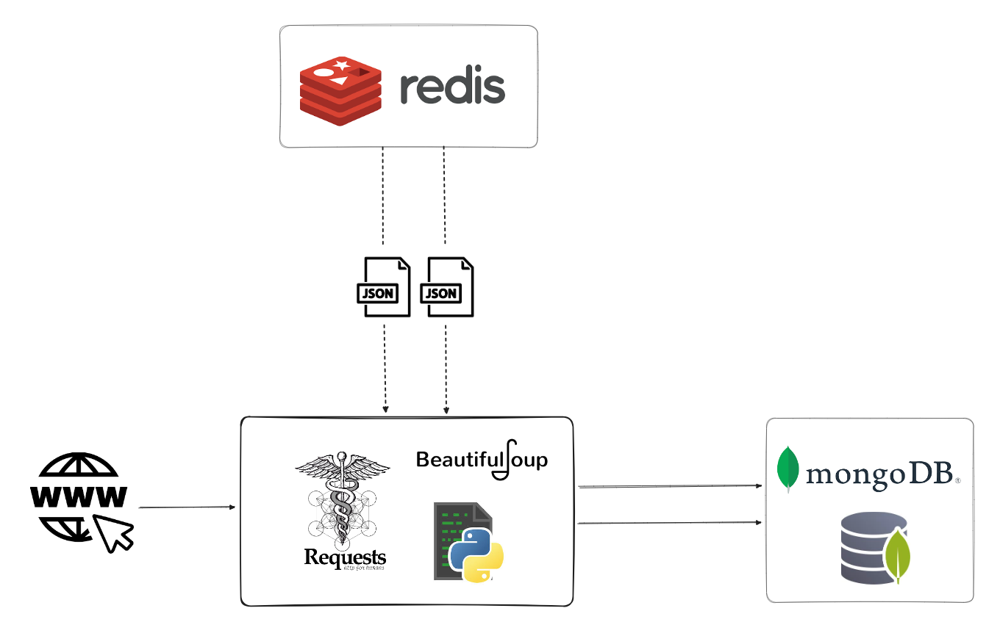

# Web crawler to extract data from property websites using noSQL databases - Redis and MongoDB

This project aims to develop a versatile web crawler for extracting data from property websites, utilizing NoSQL databases such as Redis and MongoDB.

The crawler retrieves specific tasks or inputs from Redis, allowing data extraction processes across multiple sites using a single script. In this project two portuguese sites were scraped: [CASASAPO](https://casa.sapo.pt/) and [Imovirtual](https://www.imovirtual.com/).

Data extraction is performed using the requests library, and the raw data is stored directly in MongoDB for further processing and analysis.

Using the pytest package, integration tests were also implemented with databases and a response test for all the URL links present in keys from Redis

The project is based on [this repo](https://github.com/lvgalvao/data-engineering-roadmap/tree/main/05-redis-mongodb-esse-tal-de-nosql).

## Context

By separating the generic Python web crawler from the site-specific details, we can organize the extraction process and avoid making changes to the Python script related to eventual HTML changes in website structures, for example. In cases like that, changing the inputs in Redis keys will be sufficient to keep the script running. It also allows us to scale the process to more websites in a simpler way, by adding their html sctructure to a new Redis key.   

Although this is a very useful approach, it won't always be possible to adapt all the websites to the same crawler structure. In cases like that, a specific solution will always be needed.

## How it works

After receiving a specific website key identification, the script retrieves all the inputs from the Redis database in a JSON format. These inputs are responsible for the URL requests and capturing the HTML structure of the target site for extraction. It also receives a query specifying the location in Portugal from which to search for properties. 

The extraction process utilizes the BeautifulSoup package, and through a recursive function, it identifies additional pages for extraction if present.

To establish connections with both Redis and MongoDB, the generic crawler inherits from an abstract class.

After extracting all the raw data, it is stored directly in the MongoDB database for further processing and analysis.

### Project folder structure

## How to run this project

## Further tasks

* Since it stores raw data, it is necessary to add a transformation and manipulation step to clean the data;
* There are no verifications to deal with entries that may already be stored in the database;
* Adding more websites can test the versatility of the generic crawler and improve it;
* A frontend interface can be created to return the data in a specific format to the user.